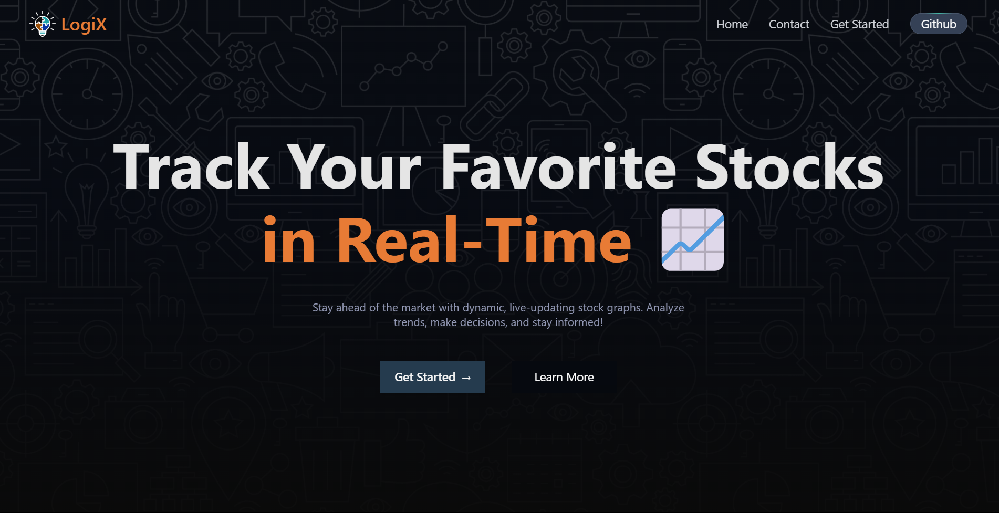
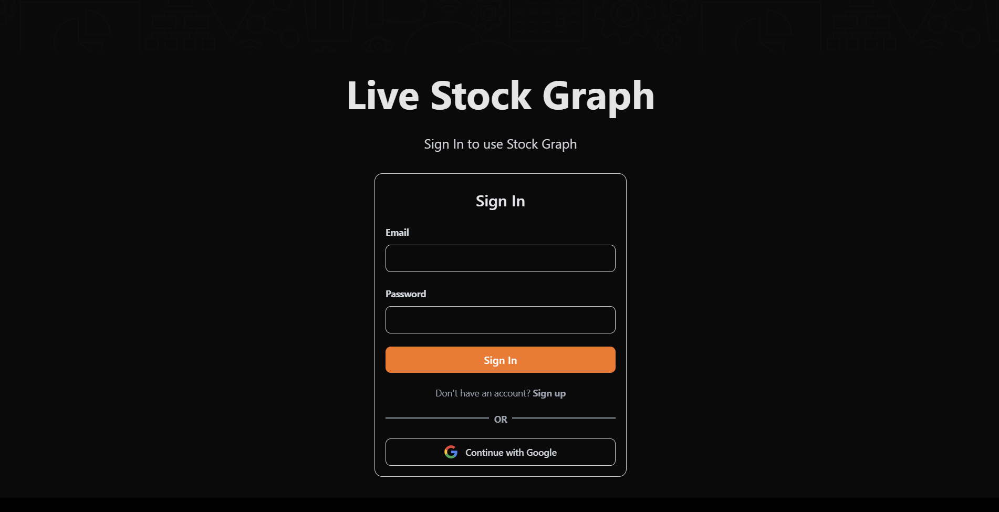
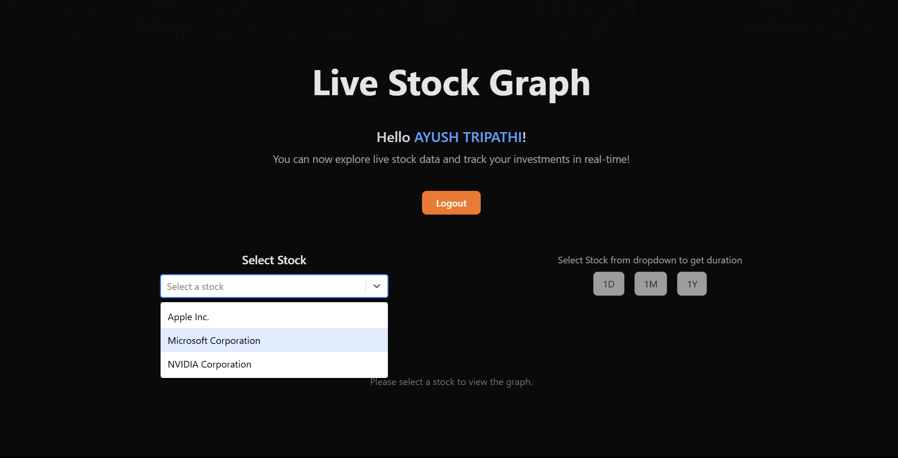
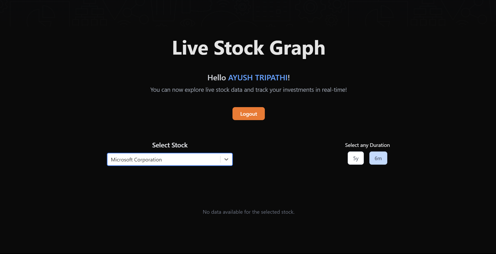

# Project Overview

This project is a responsive single-page frontend application that dynamically updates stock graphs using a given API. The live version of the project can be accessed at: [https://assesment-alloan.web.app/](https://assesment-alloan.web.app/)

## Objective

The objective of this project is to build a responsive frontend that displays dynamically updating stock graphs. The application allows users to select a stock, switch between durations, and view the corresponding graph that updates in real-time.

## What I Have Done (Solution Overview)

- Implemented a dropdown for selecting stocks.
- Added functionality to switch between different durations for the selected stock.
- Created a dynamically updating graph for the selected stock and duration.
- Ensured the application is responsive and visually appealing.
- Used Redux Toolkit for state management and thunk for API calls.

## Technology Used

- React.js
- Redux Toolkit
- TypeScript
- Vite
- react-chartjs for data visualization
- Axios for API calls
- TailwindCSS
- Thunk

## How to Use the Website

1. **Get Started**: click the **"Get Started"** button on the Landing Page.
    
2. **Select a Stock**: Use the dropdown menu to select a stock.
    
3. **Switch Duration**: Choose the desired duration for the selected stock.
    
4. **View Graph**: The graph will update dynamically to display the stock data for the selected duration.
    

## How to Run the Project

### Instructions to Run the UI

1. Clone the repository:
    ```bash
    git clone https://github.com/ayushflows/Alloan.ai-Stock-Graph-Assesment.git
    ```
2. Navigate to the frontend directory:
    ```bash
    cd frontend
    ```
3. Install dependencies:
    ```bash
    npm install
    ```
4. Start the development server:
    ```bash
    npm run dev
    ```
5. Open your browser and navigate to `http://localhost:5171`

### Instructions to Run the Backend API

1. Navigate to the backend directory:
    ```bash
    cd backend
    ```
2. Install dependencies:
    ```bash
    yarn install
    ```
3. Start the backend server:
    ```bash
    yarn start
    ```
4. The backend server will be running on `http://localhost:3000`

### Add a Demonstration Video

Make a demonstration video showcasing the frontend, not longer than 2-3 minutes. Explain what you have done and how the application works.

