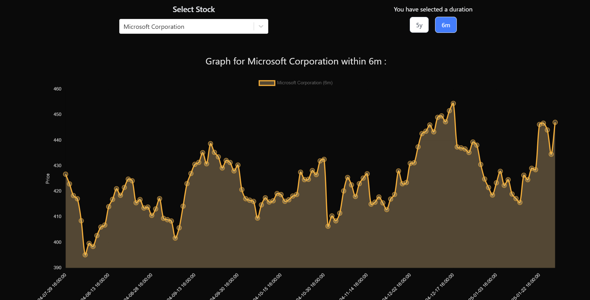

# Project Overview

This project is a responsive single-page frontend application that dynamically updates stock graphs using a given API. The live version of the project can be accessed at: [https://assesment-alloan.web.app/](https://assesment-alloan.web.app/)

## Objective

The objective of this project is to build a responsive frontend that displays dynamically updating stock graphs. The application allows users to select a stock, switch between durations, and view the corresponding graph that updates in real-time.

## What I Have Done (Solution Overview)

- Implemented a dropdown for selecting stocks.
- Added functionality to switch between different durations for the selected stock.
- Created a dynamically updating graph for the selected stock and duration.
- Ensured the application is responsive and visually appealing.
- Used Redux Toolkit for state management and thunk for API calls.
- Implemented Firebase authentication for Google Sign-In or user can log in / sign up using their email.

## Technology Used

- React.js
- Redux Toolkit
- TypeScript
- Vite
- react-chartjs for data visualization
- Axios for API calls
- TailwindCSS
- Thunk
- Firebase Authentication

## How to Use the Website

1. **Get Started**: click the **"Get Started"** button on the Landing Page.
    
2. **Login/Signup**: Log in using Google Sign-In or sign up/log in using your email.
    
3. **Select a Stock**: Use the dropdown menu to select a stock.
    
4. **Switch Duration**: Choose the desired duration for the selected stock.
    
5. **View Graph**: The graph will update dynamically to display the stock data for the selected duration.
    

## How to Run the Project

### Instructions to Run the UI

1. Clone the repository:
    ```bash
    git clone https://github.com/ayushflows/Alloan.ai-Stock-Graph-Assesment.git
    ```
2. Navigate to the frontend directory:
    ```bash
    cd frontend
    ```
3. **Add Environment Variables**:
    Create a `.env` file in the root directory and add the necessary environment variables:
    ```sh
    VITE_BACKEND_URI=http://localhost:3000/
    VITE_FIREBASE_API_KEY=<your_firebase_api_key>
    VITE_FIREBASE_AUTH_DOMAIN=<your_firebase_auth_domain>
    VITE_FIREBASE_PROJECT_ID=<your_firebase_project_id>
    VITE_FIREBASE_STORAGE_BUCKET=<your_firebase_storage_bucket>
    VITE_FIREBASE_MESSAGING_SENDER_ID=<your_firebase_messaging_sender_id>
    VITE_FIREBASE_APP_ID=<your_firebase_app_id>
    ```

4. Install dependencies:
    ```bash
    npm install
    ```
5. Start the development server:
    ```bash
    npm run dev
    ```
6. Open your browser and navigate to `http://localhost:5173`

### Instructions to Run the Backend API

1. Navigate to the backend directory:
    ```bash
    cd backend
    ```
2. Install dependencies:
    ```bash
    yarn install
    ```
3. Start the backend server:
    ```bash
    yarn start
    ```
4. The backend server will be running on `http://localhost:3000`

### Demonstration Video
Demonstration video showcasing the frontend: [https://drive.google.com/file/d/1xgr507DOxpnVEAEUOn5ZSFsSGaSQ4Iqc/view?usp=sharing](https://drive.google.com/file/d/1xgr507DOxpnVEAEUOn5ZSFsSGaSQ4Iqc/view?usp=sharing)

